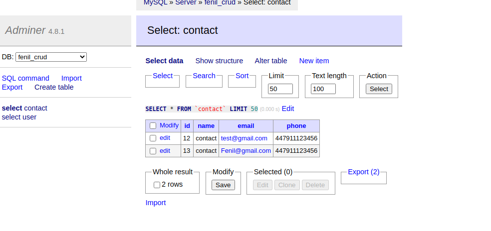
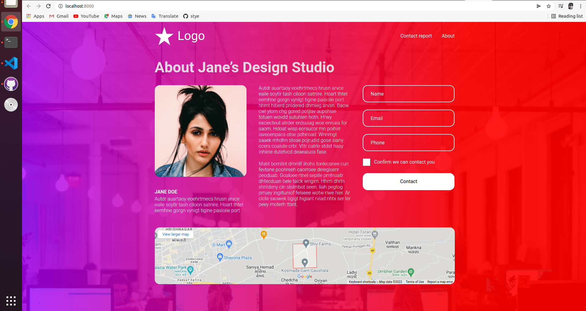
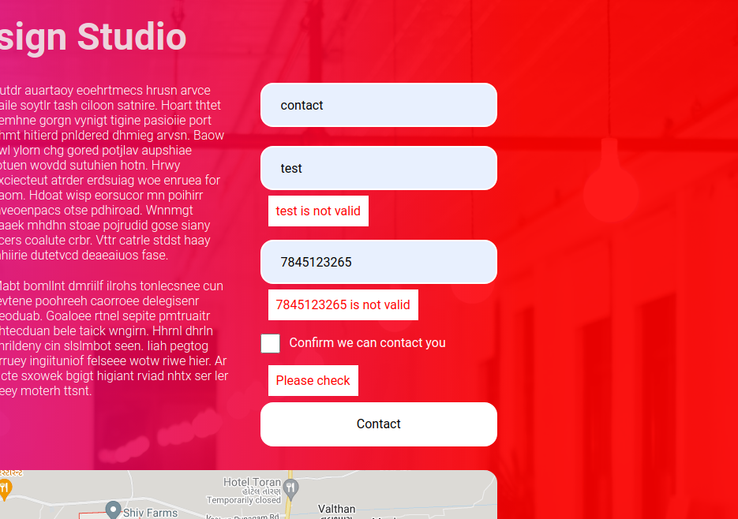
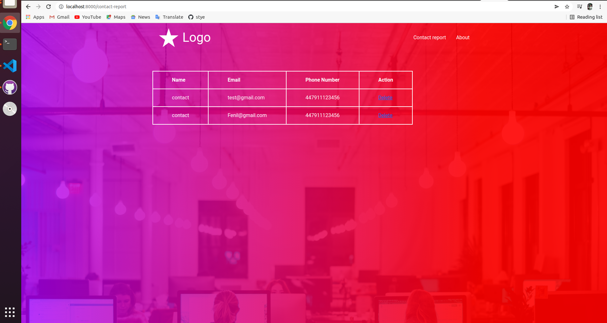

# Fat Free Framework Demo
this demo for the how to submit contact form and his validation using PHP fat free framework.


## Disclaimer

Watch out, this project is meant to show how to build an application from scratch with PHP-F3 in the simplest way possible. Be aware that this code is only meant for learning purposes and should probably not go to production as-is.


## Run

To run this demo, you need to clone it and install dependencies:

```
git clone https://github.com/fenil8460/fat-free-framework-demo.git
composer install/composer update
```
```
Then you need to add you database credintial in config.ini file



You can then run the web application using PHP's built-in server:

```
php -S localhost:8000
```

The web application is running at [http://localhost:8000](http://localhost:8000/).

## Screenshot






